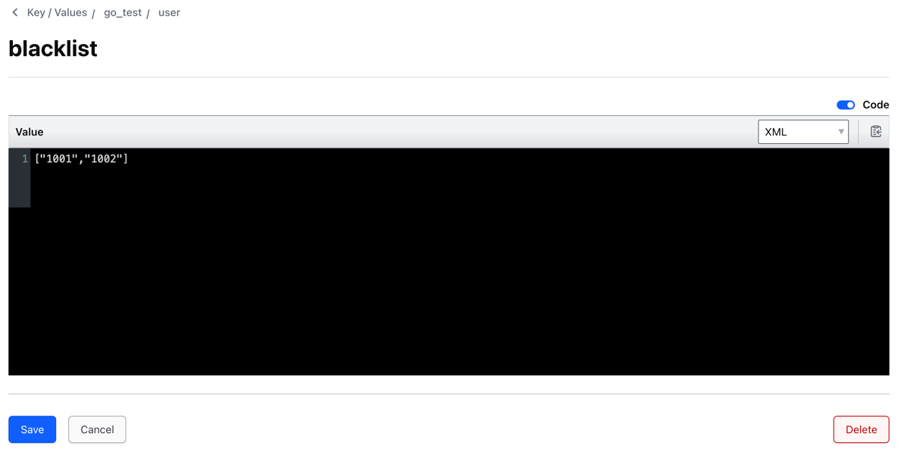
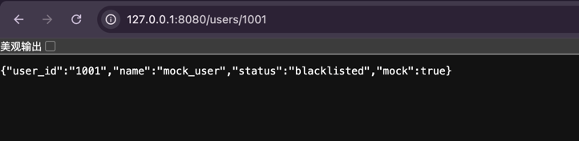

README 
1. we need to launching the consul first for other service to registring in.

Use `./.tools/consul/consul agent -server -ui  -data-dir=./tools/data   -bootstrap-expect=1  -bind=127.0.0.1 -client=0.0.0.0`

2. launching the service of go_test_api
   ```you can just run with the main.go in the go_test_api```

3. launching the service of go_test_backend
   ```you can just run with the main.go in the go_test_backend```
4. other commands you may need
Use `go mod tidy`

5. add consul key-value configuration


6. you can request the black list 

